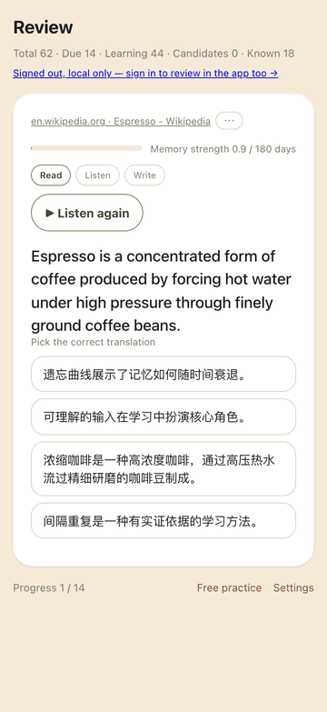
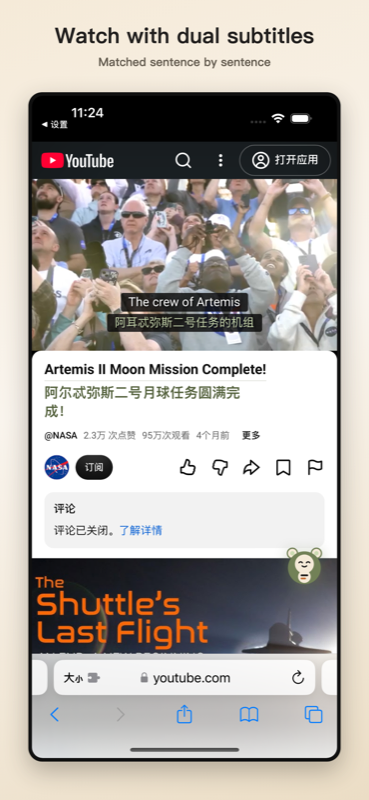
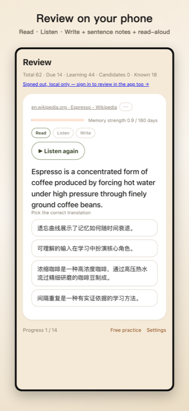

<h1 align="center">大肚猴翻译 · BelliedMonkey Translator</h1>

<p align="center">
  <b>读世界的网页 —— 两种语言同时读，读过的还能记住。</b><br>
  网页双语对照，视频与播客双语字幕。<br>
  真正读过的句子自动变成复习卡 —— 开同步后，手机上随时复习。<br>
  用你自己的 LLM key，翻译路径上没有我们的服务器。
</p>

<p align="center">
大肚猴翻译（BelliedMonkey Translator）是一款免费、开源（GPL-3.0）的浏览器扩展，支持 Safari（iPhone、iPad、Mac）、Chrome 与 Firefox。它让网页和视频字幕同时显示两种语言，把你真正读过的句子变成间隔重复的复习卡；用你自己的 AI 密钥，或者不填密钥用免费通道。没有订阅，不强制注册账号。
</p>

<p align="center">
  <a href="https://github.com/belliedmonkey/belliedmonkey-translator/actions/workflows/test.yml"></a>
  <a href="LICENSE"></a>
  <a href="https://belliedmonkey.cc"></a>
  <a href="https://github.com/belliedmonkey/belliedmonkey-translator/discussions"></a>
</p>

<p align="center">
  <a href="README.md">English</a> · <b>简体中文</b>
</p>

<p align="center">
  
</p>

<p align="center"><sub>点一下悬浮按钮。原文保留，译文在下面。维基百科，用你自己的 key 翻的。</sub></p>

<p align="center">
  
  &nbsp;&nbsp;
  
</p>
<p align="center"><sub>真正读过的句子会变成复习卡 —— 手机上、Mac 上都能复习。选译文、打分，间隔重复安排下一次。</sub></p>

---

## 安装

从商店安装即可。从源码构建是给贡献者的，不是给使用者的。

| 平台 | |
|---|---|
| **iPhone · iPad · Mac**（Safari） | [**App Store**](https://apps.apple.com/app/belliedmonkey-translator/id6787190032) —— 三个平台共用同一个 App 记录 |
| **Chrome · Edge**（桌面） | [**Chrome 网上应用店**](https://chromewebstore.google.com/detail/ilnmffeejeohomjelipejdldhkjeoinf) —— 商店审核慢，也可直接下载[**最新 ZIP**](https://github.com/belliedmonkey/belliedmonkey-translator/releases/latest/download/belliedmonkey-translator-chrome.zip)（当前 v1.4.2），步骤见下 |
| **Firefox**（桌面 · Android） | [**Firefox 附加组件**](https://addons.mozilla.org/firefox/addon/belliedmonkey-translator/) |
| **iPhone 上的 Chrome / Firefox** | 做不到 —— iOS 禁止 Safari 以外的浏览器装扩展。这是平台规则，不是本项目的缺口 |

装好后打开扩展设置，选一个翻译引擎，就没有别的步骤了。

在用？说说你拿它做什么、想改什么 —— [Discussions 里的开放帖](https://github.com/belliedmonkey/belliedmonkey-translator/discussions)，中英文都行。

<details>
<summary><b>直接安装 ZIP（Chrome / Edge）</b></summary>

商店审核可能落后一个版本；[最新 ZIP](https://github.com/belliedmonkey/belliedmonkey-translator/releases/latest/download/belliedmonkey-translator-chrome.zip) 始终是最新发布版，与提交商店的源码一致。图文教程：[belliedmonkey.cc/#install](https://belliedmonkey.cc/#install)。

1. 解压下载的文件，得到一个文件夹——请保留它，Chrome 会从这个文件夹运行扩展。
2. 打开 `chrome://extensions`（Edge 为 `edge://extensions`），开启右上角的**开发者模式**。
3. 点击**加载已解压的扩展程序**，选择刚才解压出的文件夹。
4. 在拼图菜单 🧩 里固定图标。直接安装不会自动更新——新版本请到 [Releases](https://github.com/belliedmonkey/belliedmonkey-translator/releases) 下载，或使用商店版获得自动更新。

</details>

<details>
<summary><b>从源码构建</b></summary>

零依赖，无需 `npm install`。需要 Node.js ≥ 16。

```bash
node build.js                     # Chrome / Safari  → dist/  + belliedmonkeytranslator.zip
node build.js firefox             # Firefox          → dist-firefox/ + .xpi
node build.js --flavor china      # 中国版            → dist-china/
```

在 `chrome://extensions` 开启开发者模式 → 加载已解压的扩展程序 → 选 `dist/`。

Safari 还需要 macOS + 完整版 Xcode：

```bash
bash build-safari.sh                  # 生成 iOS 工程
bash build-safari.sh global macos     # 或 macOS 工程
BUILD_NUMBER=11 bash build-safari.sh global macos   # 上传时显式指定 build 号
```

在 Xcode 里给**两个 target** 都设好 Team → 选中你的设备 → Run。然后在手机上打开
**设置 → Safari → 扩展**，允许访问所有网站。

两件容易踩的事：用免费 Apple ID 安装的 App **7 天后失效**（重新 Run 一次即可续期）；
macOS 上的「允许未签名的扩展」开关**每次重启 Safari 都会复位**。商店安装没有这两个问题。

`build-safari.sh` **每次运行**都会重设版本号、bundle id、显示名和上架所需的 Info.plist 键。
这是刻意的：`safari-project*/` 在 `.gitignore` 里，是纯本地状态，不反复写入就会静默漂移
（[#51](https://github.com/belliedmonkey/belliedmonkey-translator/issues/51)）。

</details>

---

## 它做什么

<p align="center">
  
  
  
</p>

一眼看完：

- **网页双语对照** —— 原文留在原处，译文紧跟在下面
- **视频双语字幕** —— YouTube、x.com 视频与播客，合并成整句、在播放头之前提前翻译
- **AI 转写字幕** —— 完全没有字幕的音视频，用你自己的转写密钥生成（不点按钮不转写）
- **复习卡** —— 由你真正读过的句子生成，读 / 听 / 写三档间隔重复；默认关闭
- **自带密钥** —— 任何 OpenAI / Anthropic 兼容端点，或不填密钥的免费 Google 通道
- **不强制账号**；多设备同步可选；只有匿名用量事件，一个开关关掉
- **Safari（iPhone、iPad、Mac）、Chrome、Firefox** —— 同一份代码，六个商店面
- **免费、GPL-3.0**；登录后可领一份我们出的 0.2 美元免费额度

**网页双语对照。** 每个段落保留原文，译文以不同颜色显示在正下方 —— 不用切标签页，不会丢失
阅读位置。译文继承原文的字体、字号、字重与对齐方式，**只有颜色不同**，并在窗口缩放后重新
测量，所以不会跑出它该待的那一栏。

**视频双语字幕。** 整段字幕**一次性预取**，合并成完整句子，再按 **60 秒滑动窗口提前翻译**。
因为翻译跑在播放头前面，延迟是看不见的 —— 你看到的是整句对齐的原文与译文，不是逐词碎片，
即使模型较慢也不会一顿一顿。

**播客与音频双语字幕。** 同一个引擎，完全没有视频画面：叠加层锚定在视口底部，跟着音频时钟走。

**任何 LLM，或者不用。** 传输层按请求**格式**而不是按厂商分派 —— Google、OpenAI 兼容的
chat completions、OpenAI 兼容的 responses、Anthropic 兼容的 messages —— 所以任何说这几种
形状之一的端点都能接，包括你自建的。你填**完整的接口地址**，我们就请求那个地址，一个字符
都不加；而你写的路径同时也决定了用哪种请求形状，所以同一个主机上的两种接口，换个地址就能切。内置引擎清单在扩展的设置页里；本仓库里的唯一真源是
[`build/providers.config.js`](build/providers.config.js)，这里**刻意不复述它** ——
每多抄一份，就多一处会过时的地方。

---

## 站点支持

绝大多数网页不需要任何针对性代码：段落切分只用标准 HTML 语义，**零站点选择器**。
下面列的是那难啃的 20% —— 标记结构会击穿通用规则的站点，或者媒体需要专门字幕获取路径的站点。

| 站点 | 页面文本 | 视频字幕 | 音频字幕 |
|---|:---:|:---:|:---:|
| **YouTube** —— 含 `m.youtube.com`、`youtube-nocookie.com` 内嵌 | 通用 | ✅ | — |
| **x.com / twitter.com** | ✅ 已去噪 | ⚠️ 需视频自带字幕轨 | — |
| **Substack** —— 含自定义域名 | ✅ | ✅ 视频文章 | ✅ |
| **Spotify** —— 单集页 | 通用 | — | ⚠️ 脆弱 |
| **维基百科** —— 以及任何带数据表格的页面 | ✅ 含信息框单元格 | — | — |
| **Apple Podcasts（网页）** · **小宇宙** | 通用 | — | ❌ 不可能 |
| **其它任何站点** | ✅ | — | ✅ 页面有字幕即可 |

**通用** —— 走通用规则，没有任何站点专属代码。
**⚠️** —— 见[已知限制](#已知限制)。
**❌ 不可能** —— 这两个站点在整个网页端都不暴露时轴字幕，没有东西可翻。它们回落为页面文本翻译。

「其它任何站点」不是托辞。任何带 WebVTT/SRT 文件或 `<track>` 的页面、任何发布
Podcasting 2.0 `<podcast:transcript>` 的播客，都能出字幕，不需要任何适配器。
Web Component 也覆盖了 —— 开放的 shadow root 会被遍历，所以把内容放在自定义元素里的站点
无需特殊处理也能工作。

### 适配过的站点不会退化

两套机制，各管一半：

- **页面文本与排版** —— 每个站点专属的排版修复都必须带一个新的回归 fixture，从该站点最小的
  排版模式提炼而来，而且**这个 fixture 必须在修复之前是红的**，红色运行记录进 issue。
  已有的 fixture 永远不会为了迁就新修复而被改动。目前 30 个，跑在真实的无头 Chrome 上。

  一个实例，issue #59：维基百科上，浮动信息框里的译文变成了表格的一个新列，把表格撑宽近一倍，
  旁边的正文被压到约 115px。修法是通用的 —— 分段器里没有出现任何域名或选择器 ——
  但维基百科从此有了属于它自己的 fixture，那个页面不会再悄悄坏掉。
- **视频与音频字幕** —— 一旦某个设备或浏览器被适配，它就**永久进入验证矩阵**，
  此后每次改动都要在**真实播放中**跑一遍。字幕刻意**不**由排版 fixture 覆盖 ——
  那道闸门的自陈范围是 Chromium 的渲染逻辑，这一点它自己写明了。

这些规则写在 [`docs/verification-spec.md`](docs/verification-spec.md) 里，不只是口头习惯。

---

## 为什么要自带 key

- **翻译路径上没有我们的服务器 —— 用自己的 key 时。** 这些请求从你的浏览器直接发往你选的服务商。
  中间没有任何东西可以记录、存储或转卖 —— 因为中间根本没有东西。（可选的**免费额度**是唯一
  一条会经过我们的路，见[隐私](#隐私)。）
- **key 只在本地。** 存在 `chrome.storage.local` 里，从不离开你的设备。
- **成本你自己控制。** 用哪个引擎、哪个模型、花多少钱，全是你的选择。也有不需要 key 的免费
  引擎可以零配置试用，不过用真正的模型效果明显更好。
- **可自行审计。** 上面每一条都是你能逐行读到的源码。这正是开源的意义。

在 **iPhone 和 iPad 上，这一切和桌面完全一样** —— 这比听起来难得多，也是这套架构看上去
不寻常的原因。见 [Safari iOS，以及为什么 service worker 什么都不做](#safari-ios以及为什么-service-worker-什么都不做)。

---

## 已知限制

提前说清楚，因为让你自己撞上更糟。

- **iOS 的视频全屏没有字幕。** iOS 把全屏播放交给系统原生播放器，网页叠加层无法在它上面绘制。
  在 iPhone 和 iPad 上，字幕是**内嵌播放**功能。这是平台边界，不是待办事项。
- **没有语音识别，以后也不会有。** 如果视频或播客没有现成的时轴字幕，你会看到一句诚实的
  `字幕不可用`，并回落到页面文本翻译 —— 而不是逐词硬猜。做 ASR 要么意味着我们得有后端，
  要么在 Safari iOS 上根本不可行，两者都被拒绝了。
- **x.com 的视频通常没有字幕轨。** X 上的字幕多数是**烧进视频画面**的，任何翻译工具都读不到。
  准备演示素材时抽查了四条视频：三条是烧进画面的字幕，一条完全没有字幕，只有一条长视频带真正的
  字幕轨。判断方法很简单 —— 播放器里有可用的 CC 按钮，我们就能翻。
- **繁体与简体中文无法区分。** 目标语言设为简体中文时，繁体中文段落会被跳过、什么都不显示
  （反之亦然）。浏览器的语言检测器把两者都报成 `zh`，要分开需要字符集分析，目前还没做。
  这是缺口，**不是设计意图**。
- **Spotify 的字幕抓取结构性脆弱。** Spotify 的 cue class 是哈希的，所以代码锚在跳转按钮
  加 `m:ss` 时间戳的结构上。它能用，也需要定期复验。仅支持单集页。
- **各浏览器刻意不完全一致。** 「已经是目标语言就不重复翻译」这个判断用的是浏览器自带的语言
  检测器，而 Safari 没有实现它。在 Safari 上请求照发。若为了统一而把所有浏览器压到 Safari
  的下限，就意味着永久为注定被丢弃的答案消耗你的配额 —— 所以这个不对称是刻意选择并写下来的。
- **句子解析要用对话模型，不能用思考（推理）型模型。** 解析向你配置的对话引擎要一小段 JSON
  正文；思考型模型会先输出推理段，常常把输出预算烧完、正文一个字没有 —— 出现这种情况时
  失败提示会写明原因，换成普通对话模型即可。

---

## 隐私

- **翻译路径上没有我们的服务器 —— 用自己的 key 时。** 请求从你的浏览器发往你选的引擎。
- **免费额度（可选）。** 登录并领取后，你可以用我们出的 0.2 美元额度翻译、朗读、转写。这条路上，你的文本会经过我们的服务器转发到模型提供方（OpenRouter），我们不保存、不记录内容，只记录每次花了多少；额度用完即停，不会自动收费。自带 key 的路径不变：文本仍从你的浏览器直接发往提供方，我们看不到。退出登录时额度在这台设备上停用；删除账号会一并删除额度记录。
- **API Key 从不离开你的设备。** 保存在 `chrome.storage.local`。
- **无追踪、无第三方统计 —— 账号可选，不注册也完整可用。** 只有在你自己的设备之间同步学习材料
  才需要一个免费账号；其它一切功能都不需要。
- **匿名用量事件，一个开关可关。** 扩展会发送用了哪些功能、在哪个浏览器、翻译成功还是失败 ——
  不含你读的网页、文字、地址、密钥或账号。每台设备一个随机 id，永不与账号关联；在设置里
  关掉即删除这台设备发过的数据。中国版一个字节都不发。详见
  [`docs/telemetry-design.md`](docs/telemetry-design.md)。
- **学习材料在你的设备上生成。** 打开学习功能后，扩展会把你真正读过的句子 —— 连同页面
  地址、标题和停留时长 —— 存在这台设备的本地存储里，按遗忘曲线再推给你。它默认关闭，
  **除非你开启同步**，否则一直只在本机，一键可全部清空。
- **朗读练习的录音只去你指定的地方。** 如果你配置了转写引擎并使用朗读题，录音只会发到
  你自己选定的那个端点 —— 别无他处 —— 转写返回后立即丢弃，绝不存储、绝不同步、绝不经过
  我们的任何服务器。不配置转写引擎，朗读题就不会出现。
- **App 里的「对话 · 实时听译」把麦克风的声音只发去你指定的地方。** 它只在你按下「开始听」
  之后、只把麦克风音频实时发送到你自己配置的转写端点；我们的服务器不接触音频；不保存任何
  录音，只保留文字，且只在「对话进复习」开着时保留。没有带实时接口的转写引擎，这个模式就不会出现。
- **为翻译发送出去的**只有待翻译的文本，别无其它 —— 不含 URL、不含页面标题、不含
  referrer、不含任何标识符。**如果你开启同步，同步发送的内容不同且更多：扩展保存的每一个
  句子、它来自的页面地址与标题、以及你复习它的时间 —— 以可读形式存储在我们的服务器上。**
  按来源删除学习材料是账号级的：删除会同步到你的所有设备。这也正是扩展向 Firefox 声明的
  `data_collection_permissions` 内容：`websiteContent`、`browsingActivity` 与
  `personallyIdentifyingInfo`（你的账号邮箱）。

完整政策：[belliedmonkey.cc/privacy.html](https://belliedmonkey.cc/privacy.html)

---

## 给开发者

### Safari iOS，以及为什么 service worker 什么都不做

在 Safari iOS 上，设备锁屏后 background service worker 会**永久失效**，此后 content script
里的 `chrome.runtime.sendMessage()` **静默失败** —— 不抛异常，不 reject。表现是：扩展好好的，
你把手机揣进兜里，再拿出来翻译就永远死了，直到强退 Safari。

所以这里把标准的 MV3 架构倒了过来：**所有服务商的 `fetch()` 都在 content script 里执行**
（[`extension/content/translation-api.js`](extension/content/translation-api.js)），
content script 直接从 `chrome.storage.local` 读设置，而不是去问 worker。
[`extension/background.js`](extension/background.js) 只有 64 行，负责默认值、角标和清缓存 ——
它从不在关键路径上。

### 字幕是怎么拿到的

绝不逐词翻译，也绝不抓取已渲染的字幕。整段字幕一次性取回，合并成句，提前于播放翻译。

难的是拿到字幕，而且各来源不同。YouTube 用一个只有它自己播放器能生成的 pot（proof-of-origin
token）守住 `/api/timedtext` —— 伪造的请求会返回 **HTTP 200 加一个空 body**，这是最糟的
失败模式。所以扩展让 YouTube 自己去取，然后从 **Resource Timing API** 里读出 YouTube 自己
那条请求的 URL，再拿这条 URL 重新 fetch。由于该缓冲区会被驱逐，有一个 28 行的
`document_start` 脚本专职在 URL 消失前把它记下来。x.com 反而简单 —— 它的字幕分段不受
token 限制；播客则用页内的 WebVTT/SRT 或 feed 里的 `<podcast:transcript>`。

### 构建与测试

```bash
npm test              # 纯逻辑测试套件，零依赖，Node ≥18
npm run test:layout   # 29 个排版 fixture，跑在真实无头 Chrome 上（Node ≥22）
```

任何改动 `extension/content/**` 或 `extension/styles/**` 的推送**必须**先跑
`npm run test:layout`。CI 跑单元测试和全部三种构建；它**刻意不跑**排版语料库和设备矩阵，
并且在 workflow 注释里写明了这一点 —— 绿徽章不该被读成覆盖了它没覆盖的东西。

### 规则写在哪

| 文档 | 它拥有什么 |
|---|---|
| [`docs/domain-design.md`](docs/domain-design.md) | 领域模型：`source → Extractor → units → Engine → Renderer`、零站点选择器规则、provider 注册表。**改这里必须先过人工评审。** |
| [`docs/verification-spec.md`](docs/verification-spec.md) | 一切如何被验证。全矩阵规则、各平台的坑、诚实性规则。 |
| [`docs/interaction-spec.md`](docs/interaction-spec.md) | 面向用户的交互与排版约束。 |
| [`docs/regression-tests.md`](docs/regression-tests.md) | 人工设备检查清单。 |
| [`AGENTS.md`](AGENTS.md) | 人类与 AI agent 在这个仓库里的工作约定。 |

### 代码结构

```
extension/
├── manifest.json           Manifest V3 —— Chrome / Safari / Firefox 通用
├── background.js           只管状态，从不翻译（原因见上）
├── content/
│   ├── translation-core.js 平台无关引擎：字幕状态机、60 秒预译窗口、
│   │                       句子合并、分页、i18n
│   ├── translation-api.js  所有服务商 fetch()，在 content script 中执行
│   ├── dom-processor.js    DomSegmenter —— 只用标准 HTML 语义，零站点选择器
│   ├── content-webpage.js  网页双语渲染
│   ├── content-youtube.js  ├─ 字幕来源，每个一个适配器
│   ├── content-podcast.js  │
│   ├── content-twitter.js  │
│   ├── site-twitter.js     └─ x.com 页面噪音清理
│   └── content-main.js     入口：读设置、路由
├── popup/ · options/       设置界面
└── _locales/               11 种语言
```

---

## 常见问题

<details>
<summary><b>和沉浸式翻译有什么不同？</b></summary>

阅读模型是一样的 —— 原文段落、译文紧跟其下、视频双语字幕。差别在于：大肚猴翻译是 GPL-3.0 开源、没有订阅、不强制账号，而且用自己的密钥时，翻译请求从你的浏览器直达模型服务商，中间没有我们的服务器。反过来说，沉浸式翻译靠手写适配支持的站点多得多，还有不用填密钥的托管方案；这两样我们都没有 —— 分段器只靠 HTML 语义工作，大多数站点不需要逐站代码，但奇怪的版式仍可能翻不好。完整对比（含 Readlang、Trancy 与浏览器自带翻译）在 [belliedmonkey.cc/alternatives](https://belliedmonkey.cc/alternatives.html)。
</details>

<details>
<summary><b>真的免费吗？有什么代价？</b></summary>

扩展和 App 免费，没有广告、没有付费档、没有内购。唯一的花费是翻译本身：用自己的 AI 密钥时按服务商价格直接付给它（便宜的模型一页约 0.0004 美元）；免费 Google 通道不花钱，但是普通机器翻译。登录后可以领一份我们出的小额免费额度（约 0.2 美元）；这条路上你的文本会经过我们的中继转发给模型服务商，我们不保存。细节见 [belliedmonkey.cc/pricing](https://belliedmonkey.cc/pricing.html)。
</details>

<details>
<summary><b>哪些数据会离开我的设备？</b></summary>

用自己的密钥时，你要翻的文本从浏览器直达你选的服务商。除非你打开同步并登录，否则别的什么都不会离开；打开后，你保存的句子、来源网址和复习时间会存在你的账号下。没有广告、没有追踪；唯一收集的是匿名用量事件（用了哪些功能，从不含页面内容），一个开关关掉。见[隐私](#隐私)。
</details>

<details>
<summary><b>能用哪些翻译引擎？</b></summary>

不填密钥的免费通道，或者你自己任何 AI 服务的密钥 —— 内置清单在 [`build/providers.config.js`](build/providers.config.js)，任何 OpenAI / Anthropic 兼容端点都能接，包括公司网关或你自建的模型。你填完整的接口地址，我们就请求那个地址。
</details>

<details>
<summary><b>为什么不直接用浏览器自带的翻译？</b></summary>

自带翻译会替换整页，原文就没了；这里两种语言同时留在原处。自带翻译也不做视频字幕，而且没法选引擎。
</details>

<details>
<summary><b>iPhone 上能用吗？</b></summary>

能 —— iPhone 与 iPad 上的 Safari 是首要目标，不是移植。锁屏后那边的 service worker 不可用，所以所有网络请求都在内容脚本里；见[Safari iOS，以及为什么 service worker 什么都不做](#safari-ios以及为什么-service-worker-什么都不做)。iOS 上的 Firefox 根本不能装扩展。
</details>

<details>
<summary><b>复习是怎么回事，能关掉吗？</b></summary>

打开学习后，你真正停下来读过的句子 —— 不是滑过去的 —— 会连同来源页一起保存，按遗忘曲线回来复习，读 / 听 / 写三种题型，带句子笔记和朗读。默认关闭；关掉之后翻译和原来一模一样。
</details>

---

## 去哪儿说话

面向用户的交流都在 [GitHub Discussions](https://github.com/belliedmonkey/belliedmonkey-translator/discussions) —— App 和扩展里那个「讨论」按钮指的就是它。

- **坏了或看不懂？** [Q&A](https://github.com/belliedmonkey/belliedmonkey-translator/discussions/categories/q-a) —— 写上版本号和你用的是哪一面（iPhone 上的 Safari、Chrome、Mac App……）。
- **想要某个站点、引擎或功能？** [Ideas](https://github.com/belliedmonkey/belliedmonkey-translator/discussions/categories/ideas) —— 先给已有的点赞，再开新的。
- **用出了我们没想到的用法？** [Show and tell](https://github.com/belliedmonkey/belliedmonkey-translator/discussions/categories/show-and-tell)。

中文英文都可以。目前没有聊天群；人够多到能让群活着的时候会开一个。

## 参与贡献

Bug 报告和站点请求都有表单 —— 上面那些字段正是决定一个问题能不能被复现的字段。
如果你希望某个站点被支持好，
[提一个站点适配请求](https://github.com/belliedmonkey/belliedmonkey-translator/issues/new?template=site_adaptation.yml)，
路线图就是这么定的。

每一处改动都会记录在一个 issue 里，写清问题、修法**以及背后的推理** —— 这样留下的不只是
diff，还有当时的思考。见 [`AGENTS.md`](AGENTS.md)。

## 许可证

[GNU General Public License v3.0 或更高版本](LICENSE)。你可以自由使用、研究、修改、分发；
衍生作品同样以 GPL-3.0 开源。

Copyright © 2026 belliedmonkey and contributors.
